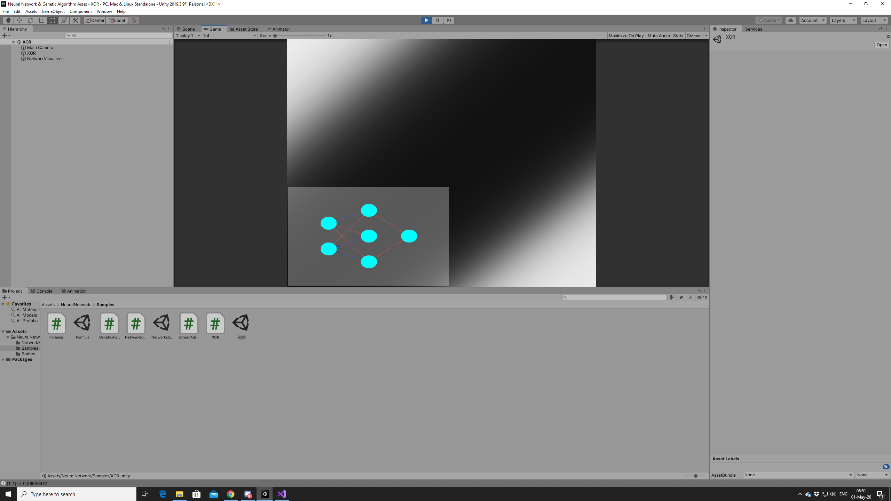
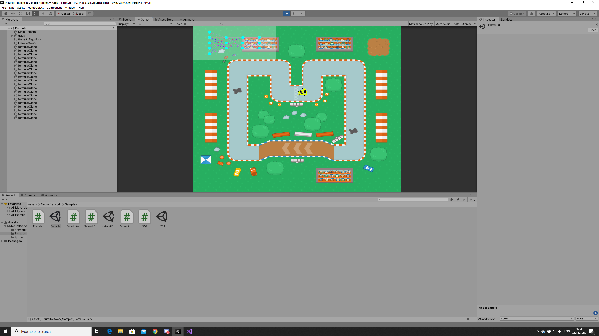

<h1>Simple Unity Neural Network Library</h1>
<p>Very simple multilayer neural network with backpropagation and genetic algorithm.</p>

<h2>Features</h2>
<ul>
    <li>Multilayer networks.</li>
    <li>Backptopagation method.</li>
    <li>Methods for genetic algorithms.</li>
    <li>Network visualizer.</li>
    <li>Simple matrix class.</li>
    <li>Useful static math methods.</li>
    <li>Two example scenes.</li>
</ul>

<h2>How to use</h2>
<p>If you don't care about the example scenes, then copy the NeuralNetwork folder to your Assets folder.</p>
<p>This line will generate a neural network with two inputs, one hidden layer (three neurons in hidden layers) and one output.</p>
```csharp
NeuralNetwork nn = new NeuralNetwork(2, 1, 3, 1);
```
<p>You can train your network like this:</p>
```csharp
// Training method from XOR example

// supervised learning
    void Train ()
    {
        // training 5k epochs
        float[] inputs = new float[2];
        float[] targets = new float[1];
        for (int i = 0; i < 5000; i++)
        {
            // randomizing data
            switch (Random.Range(0, 4))
            {
                case 0:
                    inputs[0] = 0;
                    inputs[1] = 0;
                    targets[0] = 0;
                    break;
                case 1:
                    inputs[0] = 0;
                    inputs[1] = 1;
                    targets[0] = 1;
                    break;
                case 2:
                    inputs[0] = 1;
                    inputs[1] = 0;
                    targets[0] = 1;
                    break;
                default:
                    inputs[0] = 1;
                    inputs[1] = 1;
                    targets[0] = 0;
                    break;
            }
            nn.TrainNetwork(inputs, targets);
        }
        // printing network predictions after training
        Debug.Log("[0, 0] -> " + nn.FeedForward(new float[] { 0, 0 })[0]);
        Debug.Log("[0, 1] -> " + nn.FeedForward(new float[] { 0, 1 })[0]);
        Debug.Log("[1, 0] -> " + nn.FeedForward(new float[] { 1, 0 })[0]);
        Debug.Log("[1, 1] -> " + nn.FeedForward(new float[] { 1, 1 })[0]);
    }

}
```

<p>If you want to visualize your network, you can use:</p>
```csharp
// public void DrawNetwork | Attributes: (NeuralNetwork network, int size, int layerGap, Color neuronColor, Color connectionStrong, Color connectionWeak, Color background)
visualizer.DrawNetwork(nn, 400, 5, Color.cyan, Color.red, Color.blue, new Color(1, 1, 1, 0.3f));
```

<p>Some useful extra methods:</p>
```csharp
// public static NeuralNetwork Crossover | Attributes: (NeuralNetwork nn1, NeuralNetwork nn2, float mutationPercent)
NeuralNetwork parent1;
NeuralNetwork parent2;
NeuralNetwork child = NeuralNetwork.Crossover(parent1, parent2, 5);

// public static float GetDistBetweenPoints | Attributes: (float x1, float y1, float x2, float y2)
float distance = StaticMath.GetDistBetweenPoints(hit.point.x, hit.point.y, transform.position.x, transform.position.y);

// public static float GetAngleBetweenPoints | Attributes: (float x1, float y1, float x2, float y2)
float angle = StaticMath.GetAngleBetweenPoints(hit.point.x, hit.point.y, transform.position.x, transform.position.y);

// public static float Remap | Attributes: (float value, float from1, float to1, float from2, float to2)
float newValue = StaticMath.Remap(50, 0, 100, 0, 1); // newValue = 0.5f
```

<h2>Screenshots</h2>

